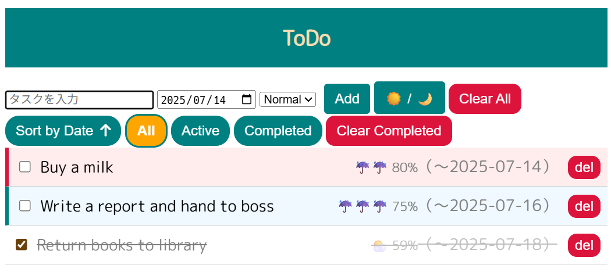
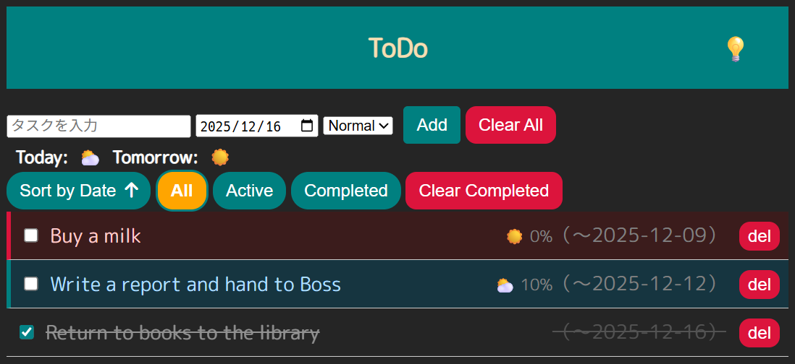

# Todo

## 📝 概要 / Overview

<!-- markdownlint-disable MD033 -->
<p align="center">
  
  
</p>
<!-- markdownlint-disable MD033 -->

これは、カジュアルに使えるシンプルな ToDo リストアプリです。ブラウザ上で完結し、リロード後も入力内容が保存されます。
This is a simple and casual ToDo list app. All tasks are saved locally and remain available even after reloading the browser.

---

## 🚀 主な機能 / Features

- タスクの追加・編集・削除
  Add, edit, and delete tasks
- 期限日の設定と日付順ソート
  Set due dates and sort by date
- タスクの状態でのフィルタ（完了／未完了）
  Filter tasks by status (completed / incomplete)
- 現地の天気アイコン表示（Open-Meteo API 使用）
  Display current weather using Open-Meteo API

---

## 🌐 デモページ / Live Demo

👉 [https://nikuman1123.github.io/Todo/](https://nikuman1123.github.io/Todo/)

---

## 🛠️ 使用技術 / Technologies Used

- HTML
- CSS
- JavaScript
- Open-Meteo API

---

## 💻 ローカルでの動作方法 / How to Run Locally

```bash
git clone https://github.com/Nikuman1123/Todo.git
cd Todo
# index.html をブラウザで開いてください
# Just open index.html in your browser
```

---

## 🙋‍♂️ 自己紹介 / Author Note

これは HTML / CSS / JavaScript の学習用に作成したアプリです。自由にご利用ください。
This app was built as a learning project for HTML, CSS, and JavaScript. Feel free to explore and modify it.

---

## 📄 ライセンス / License

このリポジトリには特別なライセンスは設定されていません。
No specific license is applied to this repository.
